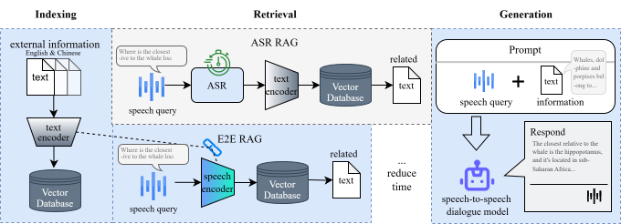

# E2E RAG for GLM-4-Voice: A Case Study 

本项目构建了具有**端到端检索增强生成（E2E RAG）能力**的端到端语音对话系统，其绕过传统的“语音转文本”环节，直接通过语音输入进行相关文本信息的检索与生成。

我们基于GLM-4-Voice模型构建系统，同时引入Meta 的 SONAR跨模态嵌入器，实现语音-文本跨模态与低延迟检索增强生成（RAG）。

[English version 👉 Click here](./README.md)



## 📝 论文
[Enhancing Speech-to-Speech Dialogue Modeling with End-to-End Retrieval-Augmented Generation](https://arxiv.org/abs/2505.00028)

## ✨ 基座模型简介
### GLM-4-Voice
GLM-4-Voice 是智谱 AI 推出的端到端语音大模型，具备以下特性：
- 支持中英文语音理解与生成
- 支持流式语音对话
- 可根据用户指令调整语音的情感、语调、语速等属性

**但：**由于不具备外部知识库检索能力，GLM-4-Voice 在如 HotpotQA 等复杂问答任务中存在性能瓶颈。

GLM-4-Voice 由三个部分组成：
* GLM-4-Voice-Tokenizer: 通过在 [Whisper](https://github.com/openai/whisper) 的 Encoder 部分增加 Vector Quantization 并在 ASR 数据上有监督训练，将连续的语音输入转化为离散的 token。每秒音频平均只需要用 12.5 个离散 token 表示。
* GLM-4-Voice-Decoder: 基于 [CosyVoice](https://github.com/FunAudioLLM/CosyVoice) 的 Flow Matching 模型结构训练的支持流式推理的语音解码器，将离散化的语音 token 转化为连续的语音输出。最少只需要 10 个语音 token 即可开始生成，降低端到端对话延迟。
* GLM-4-Voice-9B: 在 [GLM-4-9B](https://github.com/THUDM/GLM-4) 的基础上进行语音模态的预训练和对齐，从而能够理解和生成离散化的语音 token。

### SONAR：多模态语音文本嵌入器
[SONAR](https://github.com/facebookresearch/SONAR) 是 Meta 提出的多语言语音-文本嵌入工具，具备：
- 多语言支持（语音与文本双模态）
- 同一语言编码器可将语音片段与文本片段映射至同一向量空间
- 支持语音与文本的对齐与检索

我们利用 SONAR 的编码能力，实现跨模态信息的检索。

### 🧪 Qwen-Omni (TODO)
我们还预计引入 [Qwen2.5-Omni](https://github.com/QwenLM/Qwen2.5-Omni/blob/main/) 作为进一步多模态实验。

安装：

```bash
pip install git + https://github.com/huggingface/transformers@d40f54fc2f1524458669048cb40a8d0286f5d1d2
pip install accelerate
pip install qwen-omni-utils
```

## 🛠️ 环境配置
1. 克隆项目与环境创建

```shell
cd GLM-Voice-RAG
conda create -n glm-voice python=3.11 
conda activate glm-voice 
pip install -r requirements.txt -i https://pypi.tuna.tsinghua.edu.cn/simple/
```

2. (可选) 下载相关模型 Checkpoints
```shell
export HF_ENDPOINT=https://hf-mirror.com/

sudo apt install git-lfs
git lfs install
git clone https://huggingface.co/THUDM/glm-4-voice-decoder
# git clone https://hf-mirror.com/THUDM/glm-4-voice-decoder

git clone https://huggingface.co/maidalun1020/bce-embedding-base_v1
git clone https://huggingface.co/intfloat/multilingual-e5-large
git clone https://huggingface.co/openai/whisper-large-v3
```

3. 安装RAG相关工具（LangChain）
```shell
pip install langchain langchain_openai langchain_huggingface langchain_chroma

pip install rouge_score jiwer ipykernel
```

4. 安装 SONAR 嵌入器
```shell
sudo apt install libsndfile1 
conda install -c conda-forge libsndfile
pip install fairseq2 
pip install sonar-space
```
请确保安装了 sonar-space==0.3.0rc1 版本，参考官方安装文档[here](https://github.com/facebookresearch/large_concept_model?tab=readme-ov-file#installing)


## 📚 数据集
### HotpotQA
```shell
git clone https://github.com/hotpotqa/hotpot.git
```

### RGB
```shell
git clone https://github.com/chen700564/RGB.git
```

### Ours speech dataset
```shell
git clone https://huggingface.co/datasets/the-bird-F/HotpotQA_RGBzh_speech
```

## 🚀 快速开始
针对不同的数据集，我们提供了不同的运行脚本，在此可以选择运行 E2E RAG 或 ASR RAG：

```shell
# HotpotQA
python glm_voice_hotpot.py --rag e2e

# RGB
python glm_voice_rgb.py --rag e2e
```

另外，我们还提供了双轮生成的检索增强策略，可运行一下脚本：
```shell
python d_glm_voice_hotpot.py
```


## 🙏 致谢
本项目是基于GLM-4-Voice的测评工作进一步研究，原代码库是：
* [GLM-4-Voice-test](https://github.com/cwx-worst-one/GLM-4-Voice-test)

## 📄 协议说明

+ GLM-4 模型的权重的使用则需要遵循 [模型协议](https://huggingface.co/THUDM/glm-4-voice-9b/blob/main/LICENSE)。

+ 本开源仓库的代码则遵循 [Apache 2.0](LICENSE) 协议。


如果你觉得本项目有帮助，欢迎 Star ⭐️ & Fork 🔁！